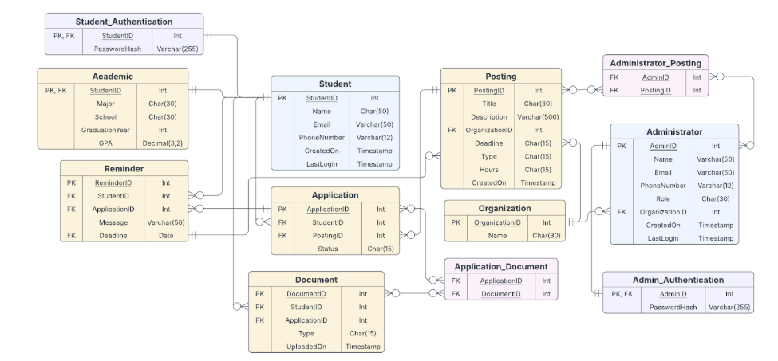

# Student Application Tracker — Database Management Project

**Team:** Akilah Qureshi, Ethan Terzic, Lydia Legan  
**Database Platform:** Oracle SQL (Oracle SQL Developer / Oracle APEX–compatible syntax)

---

## Project Overview
The **Student Application Tracker** is a relational database system designed to help students manage and track job, internship, and scholarship applications in a centralized platform. The database stores application statuses, deadlines, documents, and reminders, enabling students to stay organized while allowing administrators to manage postings efficiently.

This project emphasizes **database design, normalization, and SQL implementation**, rather than application-layer development.

---

## Objectives
- Track student applications and application statuses
- Store and manage job, internship, and scholarship postings
- Associate required documents with applications
- Provide reminder functionality for upcoming deadlines
- Enforce data integrity through constraints and business rules
- Optimize query performance using indexes and views

---

## Key Business Rules
- A student may submit **only one application per posting**
- Students cannot apply after a posting’s deadline
- Documents must belong to a student and be linked to an application
- Only administrators can create, modify, or remove postings
- Application statuses are restricted to predefined values (`Pending`, `Accepted`, `Rejected`)

---

## Database Design
The schema follows **Third Normal Form (3NF)** to reduce redundancy, prevent update anomalies, and maintain strong referential integrity.

### Core Entities
- Student  
- Administrator  
- Organization  
- Posting  
- Application  
- Document  
- Reminder  

### Association Entities
- `Administrator_Posting` (Administrator ↔ Posting)
- `Application_Document` (Application ↔ Document)

---

## Entity Relationship Diagram (ERD)

### Logical Data Model


The ERD illustrates:
- One-to-many relationships (Students → Applications, Postings → Applications)
- Many-to-many relationships resolved via junction tables
- Clear separation of authentication, academic data, and transactional records

---

## SQL Implementation
The database implementation includes:
- Primary and foreign key constraints
- CHECK constraints for controlled attribute values
- Sample insert data for testing and demonstration
- Analytical and operational queries
- Views and indexes to support performance and usability

---

## Repository Structure
```
01_database_management_project/
├── README.md
├── sql/
│ ├── 01_schema_ddl.sql -- Table definitions, constraints, normalization
│ ├── 02_seed_data_dml.sql -- Sample insert data
│ ├── 03_queries_dml.sql -- 10 business-driven SQL queries
│ └── 04_views_indexes.sql -- Indexes and reporting views
└── assets/
└── erd_logic.png
```


---

## Example Queries Included
- Retrieve applications submitted by a specific student
- List applications associated with a particular posting
- Count applications submitted per student
- Identify documents linked to internship postings
- Display reminders due within the next 7 days
- Show students with pending applications and their documents

---

## Performance Optimizations
- Indexes created on frequently joined foreign keys
- Indexed application status column for faster filtering
- Views created for common access patterns (student dashboards, active applications)

---

## Tools & Technologies
- Oracle SQL
- Relational Database Design
- Entity Relationship Modeling (ERD)
- SQL DDL & DML
- Git & GitHub

---

## Limitations & Future Improvements
- No historical tracking of application status changes
- Reminder scheduling logic would typically be handled at the application layer
- Lookup tables could replace fixed ENUM-style CHECK constraints
- Schema is optimized for transactional use; analytics would benefit from a data warehouse or star schema

---

## Author
**Ethan Terzic**  
MBA & MSIS (Data Science) Graduate  
Virginia Commonwealth University
